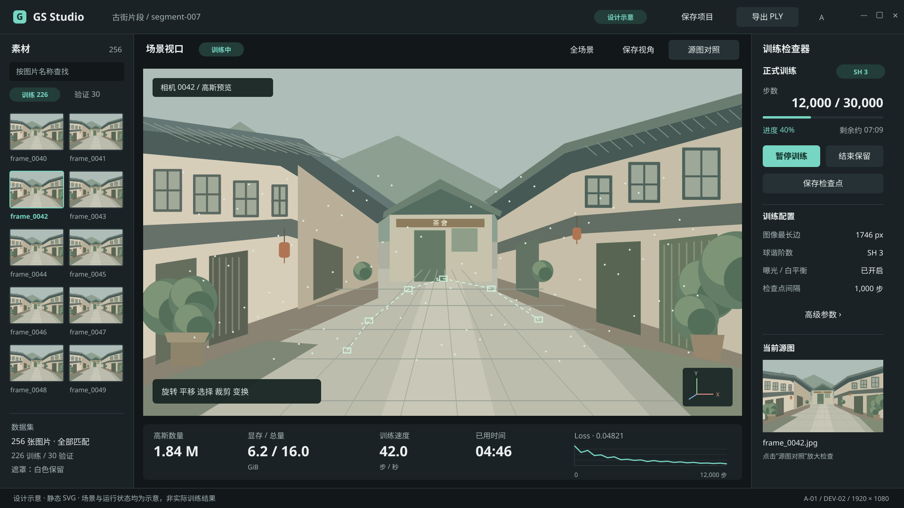
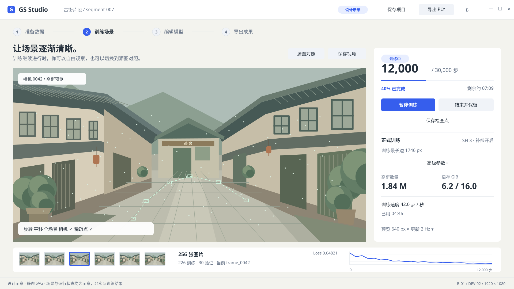
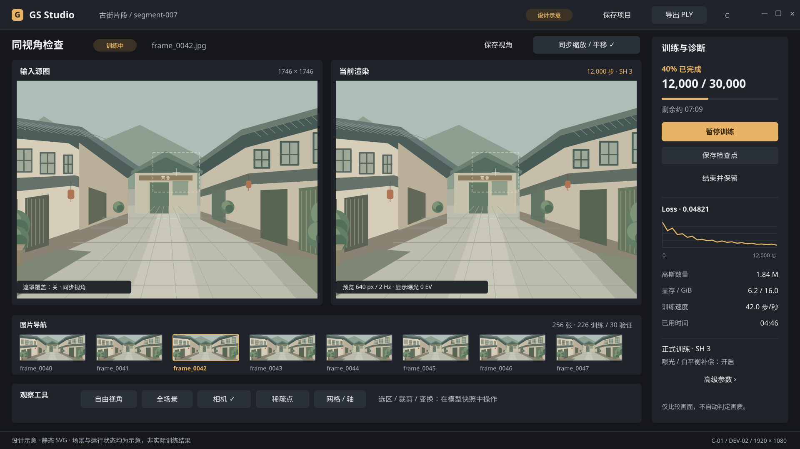
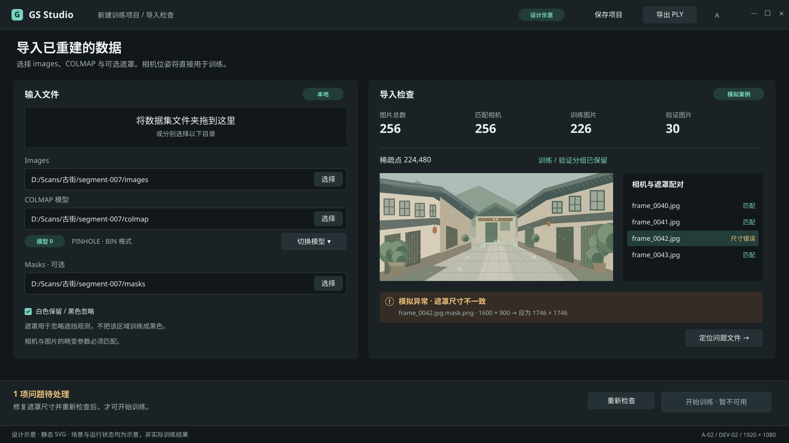
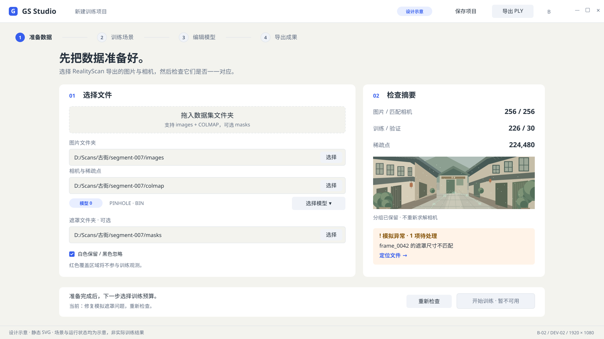
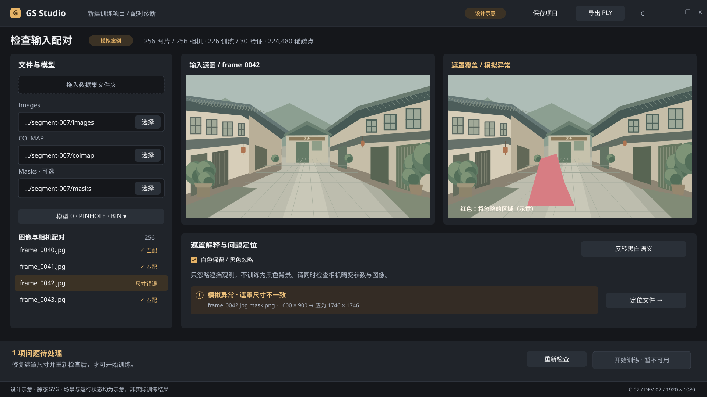

# DEV-02：三方向设计交付与比较

2026-09-13 · **六张静态稿与三份方向说明已交付；用户已选定 A 深色专业工作台，DEV-03 已完成。**

本交付关联[需求 UI-01](../../product/REQUIREMENTS.md)与[验收 AC-13](../../quality/ACCEPTANCE.md)的静态设计部分，不代表正式 UI、交互、性能或画质验收通过。

## 设计稿索引

| 方向 | 主工作台 | 导入检查 | 样式与取舍 |
| --- | --- | --- | --- |
| A 深色专业工作台 | [A-01 SVG](direction-a-workspace.svg) | [A-02 SVG](direction-a-import.svg) | [方向 A](DIRECTION-A.md) |
| B 极简创作工具 | [B-01 SVG](direction-b-workspace.svg) | [B-02 SVG](direction-b-import.svg) | [方向 B](DIRECTION-B.md) |
| C 影像检查工作台 | [C-01 SVG](direction-c-workspace.svg) | [C-02 SVG](direction-c-import.svg) | [方向 C](DIRECTION-C.md) |

六张均为独立、1920×1080 的 SVG，内嵌相同的原创矢量街景，不依赖脚本、外部图片、字体服务或网络资源。页面中的控件不可交互。

## 统一比较内容

- 数据规模：256 张图片、256 个匹配相机、226 张训练图、30 张验证图；导入摘要使用 224,480 个稀疏点。
- 工作台模拟状态：12,000 / 30,000 步，40%；Loss 0.04821；高斯 1.84 M；显存 6.2 / 16.0 GiB；42.0 步/秒；已用 04:46；剩余约 07:09。
- 正式训练示例：SH3、曝光/白平衡补偿开启、训练最长边 1746 px。预览设为 640 px / 2 Hz 的方向明确标注其为预览设置。
- 当前图片：frame_0042；素材为原创矢量街景示意，不读取现有 Data 中的照片或模型。
- 导入异常：同一个模拟遮罩尺寸错误，1600×900 与应有的 1746×1746 不一致。各稿均指明问题并禁用开始训练；并未修改真实输入。
- 数据规模借用了计划基线，运行数值与画面均为人工示意。每张图顶部和页脚都有设计示意标识，不构成任何训练证据。

## 主工作台预览

### A：空间观察优先

### B：当前步骤优先

### C：同视角对照优先

## 导入检查预览

## 比较结论

以下是对静态布局的设计判断，未进行用户测试，不是性能排名，也不替用户决定风格。

| 维度 | A | B | C |
| --- | --- | --- | --- |
| 视口面积 | 单画面 1272×738；较大且接近常驻工作台 | 单画面 1320×649；宽画面加宽松留白 | 两画面各 722×524；单图较小但等大对照 |
| 操作清晰度 | 素材、视口、训练职责分开；需要理解多个面板 | 准备/训练/编辑/导出阶段明确；主要操作数量较少 | 图片和当前渲染身份明确；诊断信息较多 |
| 对照效率 | 有源图参考和放大入口；大尺寸对照状态仍待细化 | 有源图对照入口；需展开后才能进行精细比较 | 源图/渲染默认等大并排；同步关系在稿中直接可见 |
| 可读性 | 深色中性底、独立指标带；素材密度相对较高 | 浅色、较大标题与留白；文件检查较轻松 | 图像标签清晰，数值集中；需要控制诊断信息密度 |
| 小窗口适配 | 折叠素材栏和检查器；对照时优先释放侧栏 | 缩窄摘要、图片条减少项，导入改上下布局 | 收起诊断栏；必要时改为同位置单视图切换 |
| 主要取舍 | 熟练使用更直接，初次使用学习量较大 | 入门路径清楚，跨阶段操作需要更多切换 | 精细对照直接，自由漫游面积受双图布局限制 |

视口尺寸取自 SVG 画布几何；它们不是实际应用中的有效像素、帧率或响应测量。

## UI-01 / AC-13 静态交付核对

| 项目 | 状态 | 依据与限制 |
| --- | --- | --- |
| 三方向各两张页面 | 已交付 | 上方六个 SVG，均为主工作台与导入检查 |
| 不仅更换主题色 | 已体现 | A 三栏、B 阶段流程、C 双影像对照 |
| 相同素材和状态 | 已体现 | 共用矢量街景、同一进度与输入规模 |
| 路径/模型/摘要/遮罩/问题/开始入口 | 已体现 | 三张导入稿均包含；异常明确标为模拟 |
| 保存项目/检查点/暂停/导出区分 | 已体现 | 项目级操作在顶部，训练动作在训练区 |
| 字体/颜色/间距/组件说明 | 已交付 | 三份方向说明含具体值和稿件示例位置 |
| 1280×800 收缩规则 | 已交付规则 | 未另制小尺寸稿，也未进行 DPI 或应用运行检查 |
| 用户风格选择 D-04 | 已完成 | 用户明确认可 A，见[方向决策](../../planning/decisions/D-04-UI-DIRECTION.md) |
| 完整状态、编辑细节及交互验证 | 后续 DEV-04 / 验收阶段 | 本次两页/方向不覆盖所有正式页面 |

## DEV-03 的评审结果

用户在本交付后表示“感觉A就可以了”，因此采用 A 作为正式设计基线；未要求融合 B/C。DEV-03 已完成，详见 [D-04](../../planning/decisions/D-04-UI-DIRECTION.md)。DEV-04 待补齐 A 的大尺寸源图对照、完整状态、组件及小窗口细节；选择方向不代表正式 UI 已验收。

本次仅创建静态设计资料并检查文档/标记结构，未安装依赖、启动应用或服务，未运行 CPU/GPU 测试、训练、基准、DPI 验证或后台任务。
