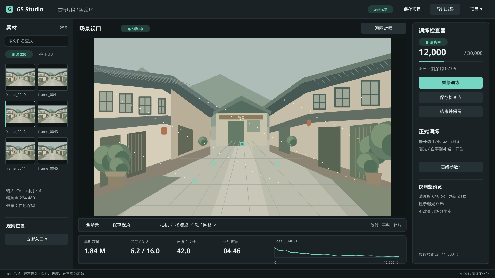
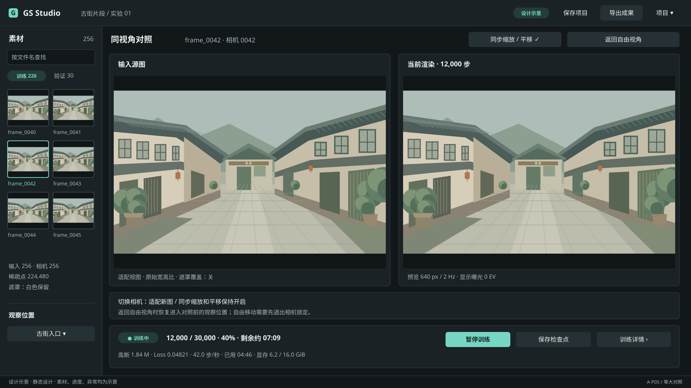
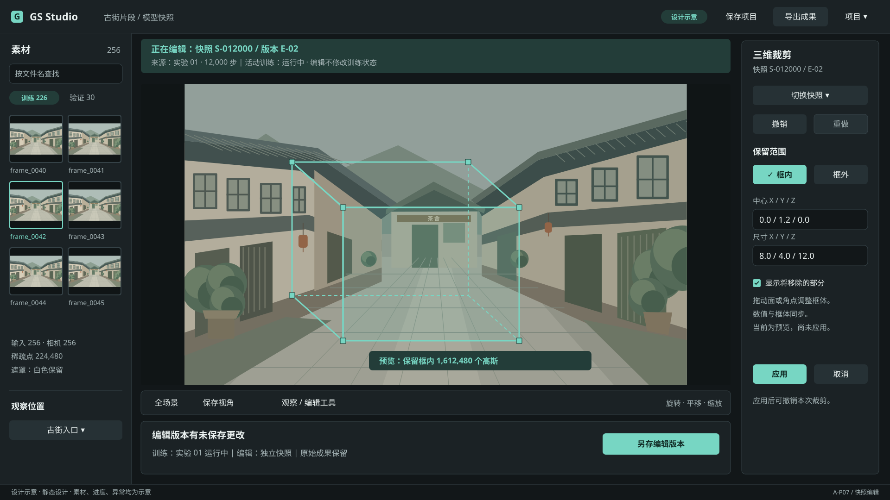
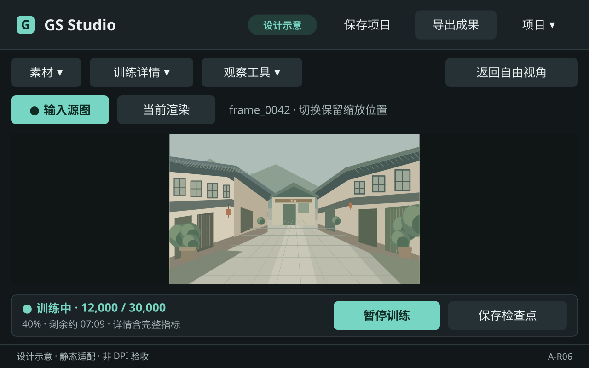

# DEV-04：A 方案页面与设计规范

2026-09-13 · **设计评审通过** · UI-02～04 / AC-13 静态设计部分

以用户选定的 A「深色专业工作台」为基线。交付 20 张独立 SVG 和本目录 4 份 Markdown；保留 [DEV-02 原稿](../deliverables/COMPARISON.md)。拖拽手柄＋数值输入为已确认的交互选择，见 [D-07](../../planning/decisions/D-07-EDITING-INTERACTION.md)。

所有页面都是不可交互的设计示意。街景、运行状态、输入路径、异常和时间均为示例，未读取真实 Data；没有测试、训练、应用、渲染服务或后台任务。本目录不含应用代码或技术架构。

## 阅读顺序

1. 本页：先看训练、对照、编辑及最小窗口，随后逐页检查流程。
2. [视觉与布局规范](VISUAL-SPEC.md)：颜色、尺寸、字体、组件及缩放规则。
3. [交互与状态说明](INTERACTIONS.md)：动作、状态、保存、恢复和编辑行为。
4. [需求覆盖与评审清单](COVERAGE-REVIEW.md)：需求映射、静态核对及后续验收边界。

## 主页面 · 1920×1080 / 100%

| ID | 页面 | 主要观察点 |
| --- | --- | --- |
| A-P01 | [空项目](01-empty.svg) | 新建、打开、拖入和无模型导出禁用 |
| A-P02 | [导入异常](02-import-errors.svg) | 完整统计、遮罩极性、问题定位和开始阻断 |
| A-P03 | [导入就绪](03-import-ready.svg) | 相机与图片联动、预设和实际配置摘要 |
| A-P04 | [训练工作台](04-training.svg) | A 三栏布局、训练控制与预览设置 |
| A-P05 | [源图对照](05-compare.svg) | 等大且保持比例、相机锁定与返回自由视角 |
| A-P06 | [快照选择](06-snapshot-selection.svg) | 快照身份、数量、高亮、反选和穿透 |
| A-P07 | [三维裁剪](07-crop.svg) | 框体手柄、数值、保留范围、预览和提交 |
| A-P08 | [场景变换](08-transform.svg) | 旋转主状态、平移/统一缩放手柄示例与轴字段联动 |
| A-P09 | [成果导出](09-export.svg) | 原始或编辑版本、属性、路径与明确的导出结果 |
| A-P10 | [项目重开与恢复](10-project-recovery.svg) | 最近有效检查点与源数据重新定位校验 |

## 状态与组件 · 1920×1080

| ID | 设计板 | 内容 |
| --- | --- | --- |
| A-S01 | [生命周期](11-lifecycle-states.svg) | 准备、等待、训练、暂停中、暂停、结束保存、完成、失败 |
| A-S02 | [保存与恢复异常](12-save-recovery-states.svg) | 项目/检查点、关闭、配置变化、OOM、损坏、失联、导出失败 |
| A-C01 | [基础组件](13-basic-components.svg) | 七类状态、路径、数值、选项和键盘反馈 |
| A-C02 | [场景组件](14-domain-components.svg) | 图片、指标曲线、反馈条、编辑、菜单及身份 |

## 尺寸适配 · 静态布局推演

| ID | 物理画布 / 显示缩放 | 逻辑布局 | 稿件 |
| --- | --- | --- | --- |
| A-R01 | 1280×800 / 100% | 1280×800 | [训练](15-training-1280x800-100.svg) |
| A-R02 | 1280×800 / 100% | 1280×800 | [对照](16-compare-1280x800-100.svg) |
| A-R03 | 1920×1080 / 150% | 1280×720 | [训练](17-training-1920x1080-150.svg) |
| A-R04 | 1920×1080 / 150% | 1280×720 | [对照](18-compare-1920x1080-150.svg) |
| A-R05 | 1280×800 / 150% | 约 853.33×533.33 | [训练](19-training-1280x800-150.svg) |
| A-R06 | 1280×800 / 150% | 约 853.33×533.33 | [单画面对照切换](20-compare-1280x800-150.svg) |

SVG 的 width/height 表示物理画布，viewBox 表示逻辑布局。将图在阅读器中缩放不等于在 Windows 执行相应 DPI 验证。

## 重点预览

### 训练工作台

### 大尺寸源图对照

### 裁剪与手柄

### 最小窗口对照

## 交付边界

用户于2026-09-13认可完整设计，DEV-04设计评审通过、M2完成。AC-13正式UI验收仍未完成。[DEV-05静态技术评估](../../research/technical-evaluation/README.md)已交付待决策；设计认可不等于技术路线已接受，不解除运行暂停约束。
